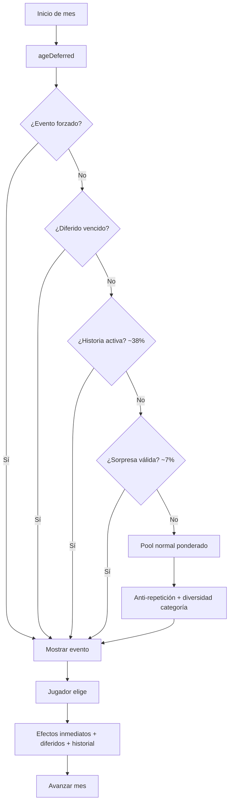

# Motor Narrativo / Decisiones V2

Sistema que decide **qué eventos son posibles para esta persona en este momento**, sin diseñar contenido narrativo nuevo.

## Arquitectura

```
CONTENT (catálogo)  →  MOTOR (picker + requisitos + efectos)  →  STATE (sesión/jugador)  →  UI
```

| Capa | Responsabilidad |
|------|-----------------|
| `src/content/catalog/` | Define eventos, opciones, requisitos |
| `src/motor/` | Elige eventos, aplica consecuencias |
| `src/motor/narrative/` | Flags, diferidos, historial, visibilidad, debug, simulación |
| `src/systems/` | Persistencia de partida |
| `src/ui/` | Presentación (sin reglas narrativas) |

## Flujo mensual



## Modelo de evento

Campos principales (todos opcionales salvo `id`, `worldId`, `title`, `options`):

```js
defineEvent({
  id: "mi_evento",
  worldId: "clasico",
  stage: "adultez",
  category: "dinero",
  kind: "normal",           // normal | important | story | special | surprise
  title: "...",
  description: "...",
  weight: 1,
  cooldown: 6,
  exclusive: false,
  rarity: "normal",         // normal | special | rare | epic | legendary
  priority: 0,
  emotionProfile: ["risk", "curiosity"],
  surprise: false,
  storyId: null,
  chapterId: null,
  requirements: { ... },
  options: [ ... ],
});
```

## Opciones y perfiles de decisión

```js
{
  id: "opcion_a",
  text: "Lo que ve el jugador",
  hint: "Contexto opcional",
  profile: "ambiguous",     // safe | risky | ambiguous | special
  visibility: "partial",    // full | partial | hidden
  revealedEffects: ["dinero"],
  requirements: { influenceMin: 60 },
  effects: {
    dinero: 100,
    felicidad: -5,
    flagsAdd: ["invirtio_negocio"],
    flagsRemove: ["duda"],
    business: { id: "cafe", tier: 1, monthlyIncome: 200 },
    houseId: "loft",
    carId: "sedan",
  },
  deferred: { type: "event", id: "callback_evento", after: 3 },
  storyProgress: { storyId: "cantante", chapterId: 2 },
}
```

### Tipos de consecuencia diferida

| type | Comportamiento |
|------|----------------|
| `event` | Dispara un evento del catálogo al vencer |
| `effects` | Aplica `effects` al jugador |
| `flags` | Activa/elimina flags (`add`, `remove`) |

## Requisitos soportados

Stats: `moneyMin/Max`, `influenceMin/Max`, `evilMin/Max`, `healthMin`, `happinessMin`

Contexto: `stage`, `stages`, `ageMin/Max`, `hasJob`, `hasPartner`, `careerId`

Flags: `requireFlags`, `forbidFlags`, `requireAnyFlag`, `flags`, `flagsNot`

Historial: `decisions` (log legacy `"eventId:optionId"`)

Historia: `storyId`, `storyChapter`, `storyActive`

Propiedad: `homeMin/Max`, `carMin/Max`, `houseId`, `carId`

Negocio: `hasBusiness`, `businessId`, `businessTierMin/Max`, `businessIncomeMin`

Relaciones: `relationshipId`, `relationshipType`, `relationshipState`, `relationshipFlags`

Pareja: `partnerTraitMin/Max`

## Historial estructurado

Cada decisión guarda en `player.decisionHistory[]`:

```js
{
  eventId, optionId, month, year, profile,
  effects: [{ key, delta }],
  flagsActivated, flagsRemoved, storyChanges, category, kind
}
```

## Herramientas de desarrollo

```bash
# ¿Por qué puede/no puede aparecer un evento?
npm run debug-event -- infancia_escuela_1 clasico

# Simular 100 vidas × 24 meses
npm run simulate -- 100 24 42 clasico
```

API programática:

```js
import { explainEventEligibility } from "./src/motor/narrative/debug.js";
import { simulateLives } from "./src/motor/narrative/simulate.js";
```

## Validación de contenido

```js
import { validateCatalogDeep } from "./src/content/catalog/validate.js";

const { errors, warnings, valid } = validateCatalogDeep(events, { storyIds: [...] });
```

## Fixtures técnicos

`src/content/fixtures/narrative-v2.js` — eventos `_fixture` solo para tests. **No** forman parte de mundos jugables.

## Reglas de diseño que el motor respeta

- 5 stats HUD: salud, felicidad, dinero, influencia, maldad
- Sin clasificación moral visible (😊/😈)
- Información incompleta vía `visibility`
- Trade-offs, no opciones dominantes
- Anti-repetición: cooldown, recentEvents, exclusividad, diversidad de categoría
- Historias no lineales vía `storyProgress` + flags

## Compatibilidad

- Picker existente extendido, no reemplazado
- `player.decisions` legacy se mantiene
- Mundo Clásico y Capitalismo sin cambios de contenido
- Tests previos + `tests/phase8/narrative-engine.test.js`
